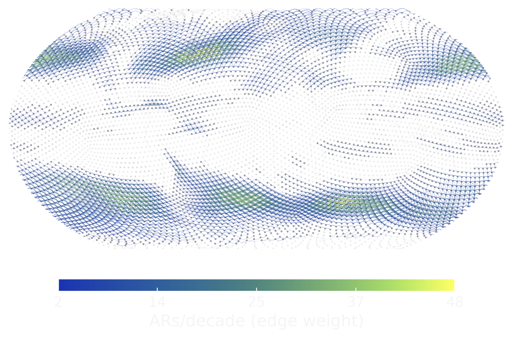

# ARnetwork.py

Codebase for constructing, analysing, and visualising **Atmospheric River Transport Networks (ARTNs)** &mdash; directed, weighted complex networks built from global catalogues of atmospheric river (AR) trajectories.


## About

Atmospheric rivers (ARs) transport vast amounts of water vapour and are responsible for a substantial share of global precipitation and wind extremes. The global AR network ingests individual AR trajectories and creates edges based on their recurrent transport patterns. ARs are localized by a suitable 2D locator, e.g., the AR centroid. The resulting Atmospheric River Transport Network (ARTN) is a directed, weighted graph. This enables us study the planetary-scale pattern of AR transport with the tools of complex network science: centralities, shortest paths, communities, random walks and secondary node/edge attributes that carry additional information on AR transport (e.g., integrated water vapour transport). 

This repository contains the analysis code accompanying the paper:

> **Tobias Braun, Sara M. Vallejo-Bernal, Norbert Marwan, Jürgen Kurths, Johannes Quaas, Albert Diaz-Guilera, Luis Gimeno, Miguel Mahecha**
> *Atmospheric river trajectories organise along a global transport network.*
> Preprint (2026). https://doi.org/10.21203/rs.3.rs-7482510/v2

The networks are built from two independent global AR catalogues &mdash; [**PIKART**](https://ar.pik-potsdam.de)  and **tARget-4** &mdash; both derived from ERA5 reanalysis. Most results in the paper are reported as the consensus of the two catalogues.

## Repository structure

```
ARnetwork/
├── analysis/      # core Python modules and analysis scripts (figures of the paper)
├── ARnetlab/      # Jupyter notebooks: exploratory analyses and extensions
├── ARTN.png       # repository header image
├── LICENSE        # Apache-2.0
└── README.md
```

The core modules used across the analysis scripts are:

- `ARnet_sub.py` &mdash; catalogue preprocessing, transport-matrix construction, network generation, and node/edge attribute handling.
- `NETanalysis_sub.py` &mdash; network analytics: Computes the hubs, highways and basins of the global ARTN. Also includes consensus averaging, predictability estimation and moisture-transport attributes for edges and nodes.
- `Nullmodels_sub.py` &mdash; random walker null model family and random rewiring for targeted null hypotheses on the ARTN topology.
- `NETplots_sub.py` &mdash; map-based plotting utilities.

## Data

The analysis draws on several publicly available datasets. The core datasets are the two AR catalogs:

- **PIKART-1** AR catalogue, together with related Python and Bash code:
  [ar.pik-potsdam.de](https://ar.pik-potsdam.de)
- **tARget v4** AR catalogue (Guan, 2024), provided by Bin Guan via the
  Global Atmospheric Rivers Dataverse:
  [dataverse.ucla.edu/dataverse/ar](https://dataverse.ucla.edu/dataverse/ar)

These are derived from the following source data:
- **ERA5** reanalysis (Hersbach et al., 2023), Copernicus Climate Data Store:
  [cds.climate.copernicus.eu](https://cds.climate.copernicus.eu/)
- **MERRA-2** reanalysis, NASA Goddard Earth Sciences Data and Information
  Services Center (GES DISC):
  [disc.gsfc.nasa.gov](https://disc.gsfc.nasa.gov/)

Additionally, the following data has been used in the manuscript:
- The **AR-CONNECT** dataset is available at the UC San Diego Library's Research Data Curation Program at \url{https://doi.org/10.6075/J0D21W00}.
- The catalog derived from the **IPART algorithm** can be generated from the code stored in the Zenodo repository at \url{https://doi.org/10.5281/zenodo.3864592}. 
- **HydroSHEDS** digital elevation model (only used for plotting topography):
  [hydrosheds.org](https://www.hydrosheds.org)
- **Oceanic Niño Index (ONI) V2**, provided by NOAA:
  [psl.noaa.gov/data/timeseries/month/DS/ONI/](https://psl.noaa.gov/data/timeseries/month/DS/ONI/)

By default, scripts read from `./data/` and write figures to `./figures/`.
Override either via environment variables:

```bash
export ARNET_DATA=/path/to/catalogues
export ARNET_FIGURES=/path/to/figures
```


## Installation

Clone the repository and install the dependencies (Python 3.9+ recommended):

```bash
git clone https://github.com/ToBraun/ARnetwork.git
cd ARnetwork
```

Core dependencies:

- `numpy`, `pandas`, `scipy`, `scikit-learn`
- `networkx`
- `h3` &mdash; H3 hexagonal grid bindings
- `matplotlib`, `cartopy`, `cmcrameri` &mdash; mapping and perceptually uniform colormaps
- `geopandas` &mdash; vector spatial data
- `tqdm`

A minimal `conda` environment to get started with:

```bash
conda create -n arnet python=3.9.20 numpy pandas scipy scikit-learn networkx \
    matplotlib cartopy geopandas tqdm -c conda-forge
conda activate arnet
pip install h3 cmcrameri
```

## Getting started

The analysis pipeline follows a consistent pattern across scripts:

0. **Regrid** AR to hexagonal coordinates (or work with a rectangular grid and risk biases).
1. **Load** hex-indexed AR catalogue.
2. **Build the transport network** with `ARnet_sub.preprocess_catalog` &rarr; `generate_transport_matrix` &rarr; `generate_network`. A clipped spatiotemporal extent or conditions can be applied. 
3. **Optional steps for analysis**, e.g. attach moisture-transport classes to edges and/or nodes via `NETanalysis_sub.compute_edge_moisture_transport` and `compute_node_moisture_transport`, or form a consensus network by averaging attributes across multiple catalogs.
5. **Analyse and plot** &mdash; Calculate network measures, e.g., edge-betweenness ("AR highways"), node/edge moisture sinks and sources, trajectory predictability, etc.

A minimal example:

```python
import pandas as pd
import ARnet_sub as artn

ARcat = pd.read_pickle("data/PIKART_hex.pkl")

l_arcats, d_coord_dict = artn.preprocess_catalog(
    ARcat, T=None, loc="centroid", grid_type="hexagonal",
    X="global", res=2, cond=None, LC_cond=None,
)
A, t_idx, t_hexidx, t_ivt, t_grid = artn.generate_transport_matrix(
    l_arcats, "hexagonal", d_coord_dict, LC_cond=None,
)
G = artn.generate_network(
    A, t_grid, weighted=True, directed=True,
    eps=16, self_links=False, weighing="absolute",
)
```

The full set of analyses reproducing the paper figures lives under `analysis/`.

## Citing

If you use this code or the network construction pipeline in your work, please cite the companion paper:

```bibtex
@article{braun2026artn,
  title   = {Atmospheric river trajectories organise along a global transport network},
  author  = {Braun, Tobias and Vallejo-Bernal, Sara and Marwan, Norbert and Kurths, J{\"u}rgen and others},
  journal = {Research Square preprint},
  year    = {2026},
  doi     = {10.21203/rs.3.rs-7482510/v2},
  url     = {https://doi.org/10.21203/rs.3.rs-7482510/v2}
}
```

## License

Released under the [Apache License 2.0](LICENSE).

## Contact

Tobias Braun &mdash; Postdoctoral researcher, University of Leipzig &middot; Potsdam Institute for Climate Impact Research
For questions, issues, and suggestions, please open an [issue](https://github.com/ToBraun/ARnetwork/issues).
